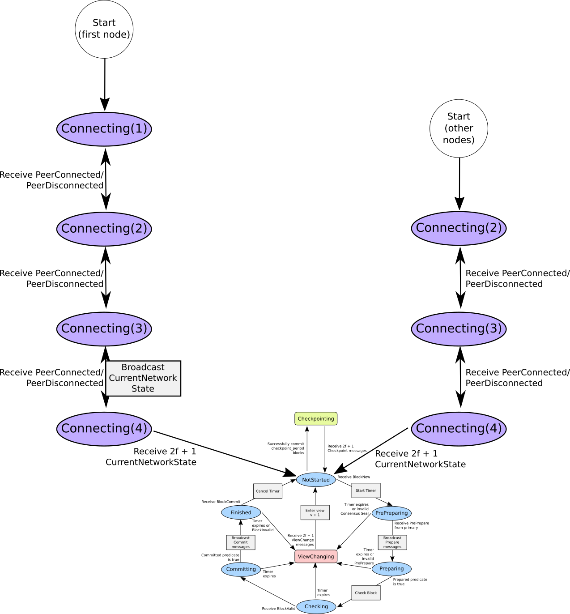

# Dynamic networking
+ First node on the network is always the primary
  + If the `peers` field of `StartupInfo` is empty, then it's the first node
+ Every node starts in `Connecting` mode
  + Starts out at `Connecting(peers.len() + 1)`
  + Keeps track of how many nodes have connected (On `PeerConnected`,
    `Connected(1)` &rarr; `Connected(2)`, etc.)
  + No messages/updates besides `PeerConnected` and `PeerDisconnected` are processed

## Connection Process
+ Primary receives `PeerConnected` updates until the network is large enough
  to be BFT
+ When primaries have enough nodes, they broadcast a tentative
  `PbftCurrentNetworkState` message with the current block, and the current
  peer list
+ When a node receives a tentative `PbftCurrentNetworkState` message, it
  verifies that the peer list matches, then broadcasts a final
  `PbftCurrentNetworkState` message
+ All nodes wait for `2f + 1` matching `PbftCurrentNetworkState` messages
  + If this node's chain head in the `PbftCurrentNetworkState` matches the one
    in the messages, then update their local `peer_ids` and enter `Normal`
    mode
  + Otherwise, use the `BlockId` from the messages to walk back along the
    chain and commit the blocks that this node missed (we can trust these
    blocks because they've all passed consensus)
+ As soon as nodes come online, a `ViewChange` timer is started. If the timer
  expires, then a `ViewChange` is initiated. If the node enters `Normal` mode
  before the timer expires, then the `ViewChange` timer is stopped.

## Normal operation
+ On `PeerConnected` or `PeerDisconnected` updates, the primary node
  broadcasts a tentative `PbftCurrentNetworkState` message
  + Other nodes only add to their `peer_ids` list, but start a `ViewChange`
    timer just in case the primary doesn't go through with the `PeerConnected`
    consensus
+ All nodes wait for `2f + 1` matching `PbftCurrentNetworkState` messages
  + If this node's chain head in the `PbftCurrentNetworkState` matches the one
    in the messages, then update their local `peer_ids` and enter `Normal`
    mode
  + Otherwise, use the `BlockId` from the messages to walk back along the
    chain and commit the blocks that this node missed (we can trust these
    blocks because they've all passed consensus)
+ If at any time, the number of nodes drops below `f`, then the network enters
  `Connecting(self.state.peer_ids.len())` state again and waits for enough
  nodes to connect using the process above.
  + If other nodes on the network are currently performing consensus when a
    node dies, then consensus pauses, and resumes in the same place once there
    are enough nodes.

## Message Types
```
enum PbftCurrentNetworkStateType {
  TENTATIVE = 0;
  FINAL = 1;
}

message PbftCurrentNetworkState {
  // The peers in this network configuration
  repeated bytes peers = 1;

  // The current block that the network is on - used to help nodes catch back
  // up to the current chain head after they've been offline
  PbftBlock current_block = 2;

  // Does this message represent a tentative configuration, or a final
  // configuration?
  PbftCurrentNetworkStateType type = 3;
}
```

## Diagram

